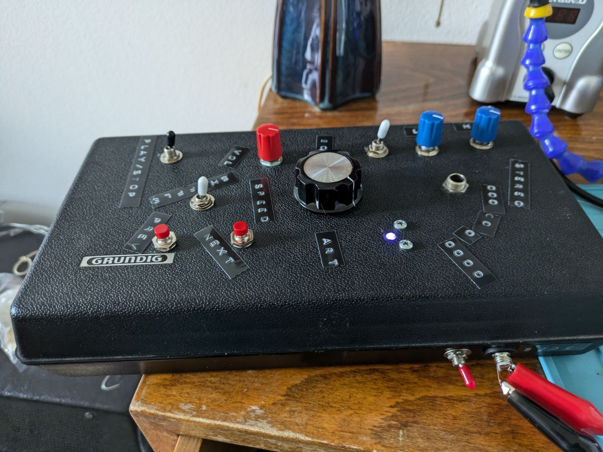
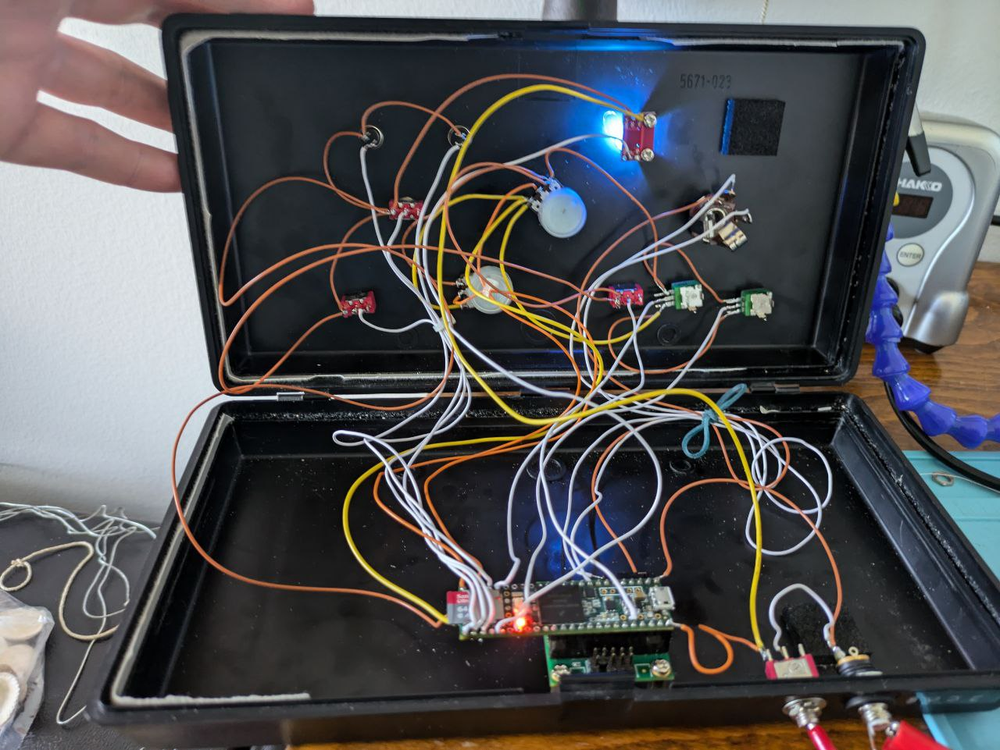

# Sound Art Jukebox

 

 

This is a sound art jukebox of sorts made with a Teensy microcontroller and a Teensy Audio Shield. The main use case for it is when you need to make a listening station of sorts for a sound art installation or similar situations. 

## Features

- Plays 44.1 khz WAV files from an SD card
- Varispeed playback
- Tone control: Adjust bass and treble (can be disabled completely)
- Can either play the audio files in shuffle or sequential mode.
- An RGB LED shows the peak of the played wave file.

## Usage

The player is plug and play. Give it power and press play and it will play infinitely. See below for instructions on how to add audio files.

### Adding audio files with the SD Card

1. The SD card should be formatted as FAT32.
2. All files should be 16 bit 44.1khz wav files.
3. Place the audio files in a folder in the root of the card named `audio`. This is where the player searches for audio files. All other folders are ignored.

#### Converting audio files to the correct format

Scripts are included with this project to make it easier to convert audio files to the correct format.

Run it from the root of this project's folder like this to batch convert a folder of files:

```bash
./convert_all.sh /path/to/unconverted /path/to/converted
```

# Development

This project is made with platformio. 

Compile it using the cli tool:

```bash
pio run
```

Upload to a Teensy 3.6 for example:

```bash
pio run -t upload -e teensy36
```

# Supported boards

The firmware has been tested with Teensy 3.6 and the Teensy 3.x audio shield.
